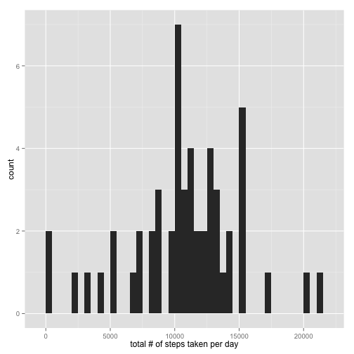

# Reproducible Research: Peer Assessment 1


```r
library(knitr)
opts_chunk$set(fig.path="figure/")
options(scipen = 5)
```

## Loading and preprocessing the data


```r
library(data.table)
dt <- as.data.table(read.csv(unz("activity.zip", "activity.csv"),
                             colClasses=c(steps="numeric",
                                          date="Date",
                                          interval="numeric")))
dt.no.na <- dt[!is.na(steps),]
```

## What is mean total number of steps taken per day?


```r
tspd <- (dt.no.na[, sum(steps), by=date])$V1
mean.tspd <- mean(tspd)
median.tspd <- median(tspd)
```

Here is the histogram of total steps taken per day.


```r
library(ggplot2)
qplot(tspd, geom="histogram", xlab="total # of steps taken per day", binwidth=500)
```

 

The mean and median are 10766.1887 and 10765 respectively.

## What is the average daily activity pattern?


```r
aspi <- dt.no.na[, mean(steps), by=interval]
max.interval <- aspi$interval[which.max(aspi$V1)]
```

Here is the plot of average daily pattern.


```r
qplot(interval, V1, data=aspi, geom="line", ylab="# of steps")
```

 

The maximum of the average number of steps happened in 5-minute interval 835.

## Imputing missing values


```r
tnmv <- nrow(dt[is.na(steps)])
```

There are totally 2304 missing values in the dataset.

We fill each of the missing values with the average number of steps taken for that 5-minute interval across all days to create a new dataset.


```r
ndt <- (copy(dt))[,mean:=aspi$V1][is.na(steps), steps:=mean][,mean:=NULL]
```

Now the histogram of total number of steps taken per day looks like this.


```r
ntspd <- (ndt[, sum(steps), by=date])$V1
mean.ntspd <- mean(ntspd)
median.ntspd <- median(ntspd)
qplot(ntspd, geom="histogram", binwidth=500,
      xlab="total # of steps taken per day")
```

 

And the new mean and median are 10766.1887 and 10766.1887 respectively.

## Are there differences in activity patterns between weekdays and weekends?

We prepare a new dataset with weekend/weekday data inserted to answer the question.


```r
is.weekend <- function(d) {
    ifelse(d == "Saturday" | d == "Sunday", TRUE, FALSE)
}

## Create the new dataset to include day of week info. It's not
## quite necessary but just to meet the requirement.
ndt <- ndt[,dow:=ifelse(is.weekend(weekdays(date)), "weekend", "weekday")]
setkey(ndt, dow)

naspi.we <- ndt["weekend", mean(steps), by=interval][,dow:="weekend"]
naspi.wd <- ndt["weekday", mean(steps), by=interval][,dow:="weekday"]

naspi <- merge(naspi.we, naspi.wd,
               by=c("interval", "V1", "dow"), all=TRUE)
```

Now the differences of the activity patterns between weekdays and weekends look like this.


```r
qplot(interval, V1, data=naspi, geom="line", facets="dow ~ .",
      ylab="# of steps")
```

 
